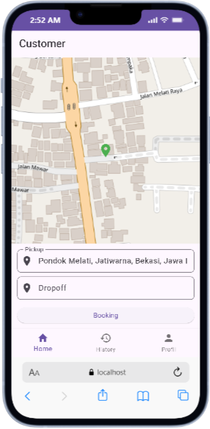
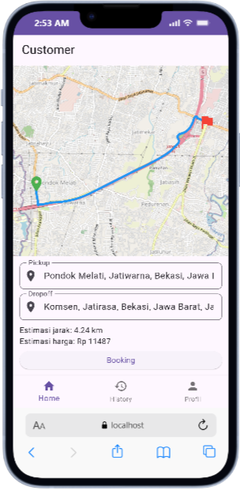
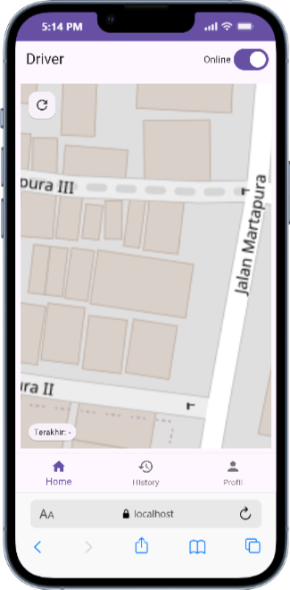

# Ojek App — Flutter + Laravel (Realtime Order)

Dibuat oleh LKP Naura — Kursus Komputer Bersertifikat
Website: https://lkpnaura.com

Catatan: Bagi yang mengunduh proyek ini, mohon beri star (⭐).

Proyek ini adalah aplikasi ojek sederhana dengan dua peran utama: `customer` (pemesan) dan `driver` (pengemudi). Frontend dibangun dengan Flutter (`ojek_app`) dan backend dengan Laravel (`ojek_backend`). Aplikasi mendukung pemesanan, penawaran driver di sekitar, pembaruan lokasi driver secara realtime, serta alur status order (dibuat, diterima, dibatalkan, selesai).



## Fitur Utama
- Pemesanan perjalanan oleh customer, estimasi jarak dan harga.
- Pencarian driver di sekitar lokasi pickup dan broadcasting order baru.
- Driver menerima atau menolak order, dengan penutupan modal realtime di perangkat lain.
- Pelacakan lokasi driver (realtime) oleh customer di halaman rute.
- Manajemen sesi (token, role, userId) agar langganan channel privat tetap berfungsi setelah restart.
- Dual-broadcast untuk event order penting: kanal publik `orders` dan kanal privat `private-orders.{id}`.

## Struktur Proyek
- `ojek_app/` — Aplikasi Flutter (Android/iOS/web/desktop).
- `ojek_backend/` — Aplikasi Laravel (API, broadcasting, events, models).
- Berkas gambar dokumentasi berada di root proyek.

## Alur Lengkap

**Customer Flow**
- Login/registrasi sebagai `customer`.
- Tentukan titik `pickup` dan `dropoff`, lihat `estimasi` jarak dan harga.
- Tekan `Order` untuk membuat order baru; dialog menunggu muncul.
- Saat driver `accepted`, dialog menutup dan diarahkan ke halaman rute, lokasi driver dipantau realtime.
- `completed` menutup rute dan menampilkan notifikasi selesai; `cancelled` menutup dialog dan reset state.

**Driver Flow**
- Login sebagai `driver` dan aktifkan status `online/active`.
- Menerima broadcast order baru (publik) atau penawaran tertarget (privat) di sekitar.
- Modal order muncul; dapat `accept` atau `reject`.
- `accept` mengikat order dan menyiarkan ke customer; driver mengirim lokasi berkala.
- `completed` menutup modal dan mengubah status ke `idle`; `cancelled` mengembalikan ketersediaan.

Ilustrasi:




## Prasyarat
- Flutter 3.x dan Dart SDK.
- PHP 8.x, Composer, dan ekstensi yang diperlukan Laravel.
- Node.js (opsional untuk asset Laravel bila diperlukan).

## Instalasi Cepat

### Backend (Laravel)
1. Masuk ke folder backend:
   ```bash
   cd ojek_backend
   ```
2. Install dependencies:
   ```bash
   composer install
   ```
3. Salin `.env.example` menjadi `.env` dan atur konfigurasi database, broadcasting (Pusher), dan SANCTUM.
4. Generate app key dan migrasi database:
   ```bash
   php artisan key:generate
   php artisan migrate --seed
   ```
5. Jalankan server pengembangan:
   ```bash
   php artisan serve
   ```

### Frontend (Flutter)
1. Masuk ke folder aplikasi Flutter:
   ```bash
   cd ojek_app
   ```
2. Install dependencies:
   ```bash
   flutter pub get
   ```
3. Konfigurasi `lib/config.dart` sesuai environment Anda:
   - `AppConfig.apiBaseUrl` mengarah ke URL API Laravel, misalnya `http://localhost:8000/api`.
   - `AppConfig.pusherKey` dan `AppConfig.pusherCluster` mengikuti pengaturan Pusher di backend.
4. Jalankan aplikasi:
   ```bash
   flutter run
   ```

## Konfigurasi Realtime & Broadcast
- Backend mengirim event order ke:
  - Kanal publik: `orders` (untuk driver umum yang memantau order baru dan status ringkas).
  - Kanal privat: `private-orders.{id}` (untuk customer pemilik order agar dialog menunggu/halaman rute bereaksi cepat).
- Event bertajuk `order.created`, `accepted`, `cancelled`, `completed` dikirim sesuai aksi di backend.
- Driver juga menerima penawaran tertarget via kanal privat `private-users.{id}` (opsional/configurable).
- Frontend berlangganan kanal melalui `BroadcastService`/`RealtimeService` dan menggunakan token Bearer untuk authorizer.

## Dokumentasi API (Scramble)
- URL: `http://localhost:8000/docs/api#/`
- Klik tombol `Authorize` di pojok kanan atas, pilih skema `bearer`, lalu tempel token Sanctum hasil `POST /api/login` (tanpa awalan `Bearer `).
- Konfigurasi security global untuk bearer sudah diatur di `AppServiceProvider`:
  ```php
  Scramble::configure()
      ->withDocumentTransformers(function (OpenApi $openApi) {
          $openApi->secure(SecurityScheme::http('bearer'));
      });
  ```
- Jika halaman docs tidak muncul, pastikan paket `dedoc/scramble` terpasang, service provider aktif, dan environment pengembangan berjalan pada `http://localhost:8000`.

## Contoh Login & Token
- Request login (ambil token):
  ```bash
  curl -X POST http://localhost:8000/api/login \
    -H "Content-Type: application/json" \
    -d '{"email":"user@example.com","password":"password"}'
  ```
- Contoh response:
  ```json
  {
    "user": {
      "id": 1,
      "name": "User",
      "email": "user@example.com",
      "role": "customer"
    },
    "token": "<SANCTUM_TOKEN>"
  }
  ```
- Gunakan token untuk endpoint terlindungi (Authorization header dengan awalan `Bearer`):
  ```bash
  curl -X POST http://localhost:8000/api/me/location \
    -H "Content-Type: application/json" \
    -H "Authorization: Bearer <SANCTUM_TOKEN>" \
    -d '{"lat":-7.8,"lng":110.4,"status_job":"idle"}'
  ```
- Di halaman docs (Scramble), klik `Authorize`, pilih `bearer`, lalu tempel isi token tanpa kata "Bearer".

## Struktur Modul

**Frontend (Flutter `ojek_app/lib`)**
- `services/api.dart` — HTTP API client, token/role/userId.
- `services/broadcast.dart` — Pusher wrapper (publik dan privat), langganan event order.
- `services/realtime.dart` — Alternatif wrapper realtime (publik/privat, lokasi driver).
- `pages/customer/customer_page.dart` — Booking, dialog menunggu, subscribe order & lokasi.
- `pages/customer/customer_route_page.dart` — Tampilan rute dan tracking driver.
- `pages/driver/driver_page.dart` — Langganan broadcast, modal order, aksi accept/reject.
- `pages/customer_order/bloc/` — State management order customer.

**Backend (Laravel `ojek_backend/app`)**
- `Http/Controllers/Api/OrderController.php` — CRUD order, accept/reject, broadcast.
- `Http/Controllers/Api/UserController.php` — Lokasi user, status job (`online/offline/active/idle`).
- `Events/` — `OrderCreated`, `OrderAccepted`, `OrderCancelled`, `OrderCompleted`, `OrderUpdate`, `DriverLocationUpdated`.
- `routes/api.php` — Definisi endpoint API.
- `routes/channels.php` — Kanal broadcast privat/publik.
- `config/broadcasting.php` — Konfigurasi driver broadcast (Pusher).

## Endpoint Penting (contoh)
- `POST /api/login` — Login dan menerima token Sanctum.
- `POST /api/register` — Registrasi user baru (role: `customer`/`driver`).
- `POST /api/orders` — Customer membuat order.
- `POST /api/orders/{id}/accept` — Driver menerima order.
- `POST /api/me/location` — Kirim lokasi user (status_job didukung: `online`, `offline`, `active`, `idle`).

## Screenshot & Ilustrasi





## Catatan
- Jika dialog menunggu pada halaman customer tidak tertutup saat order diterima, pastikan event `accepted` diterima di kanal publik `orders` atau kanal privat `private-orders.{id}` dan periksa konfigurasi Pusher/token.
- Nilai `status_job` sudah diperluas untuk mendukung `idle` agar sinkron dengan alur driver.
- Untuk mengubah mode broadcast (publik vs privat tertarget), sesuaikan event di `ojek_backend/app/Events/` dan langganan di `ojek_app/lib/services/broadcast.dart`.

## Cara Uji Alur (Quick Test)
- Jalankan backend (`php artisan serve`) dan frontend (`flutter run`).
- Login sebagai `customer`, buat order; pastikan dialog menunggu muncul.
- Login sebagai `driver` kedua (atau perangkat lain), terima order.
- Pastikan pada customer, dialog tertutup, snackbar muncul, dan halaman rute terbuka.
- Gerakkan lokasi driver (API `me/location`) dan cek peta customer mengikuti driver.
- Selesaikan order; pastikan event `completed` menutup alur dengan benar.

---
Silakan sesuaikan README ini jika Anda menambah fitur atau mengubah alur kerja. Jika ada gambar tambahan di root, tambahkan dengan format:

```md

```